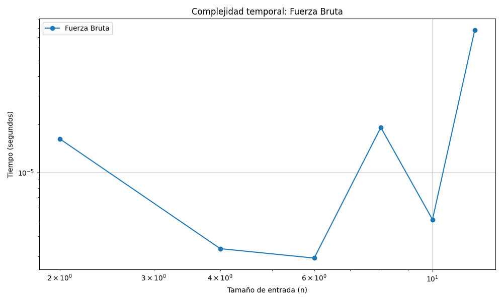
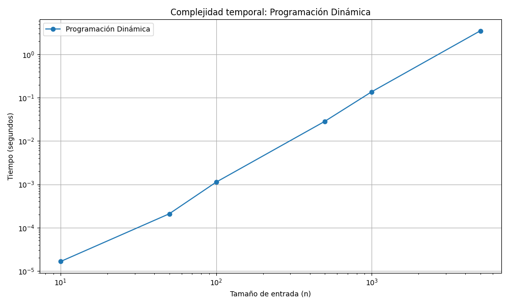
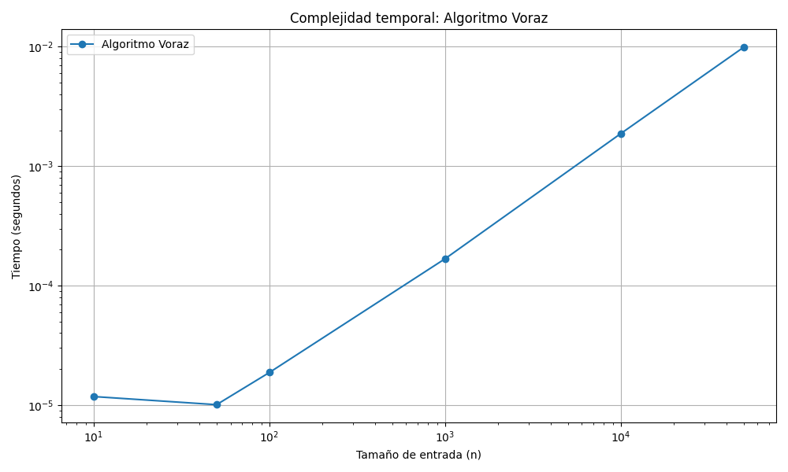
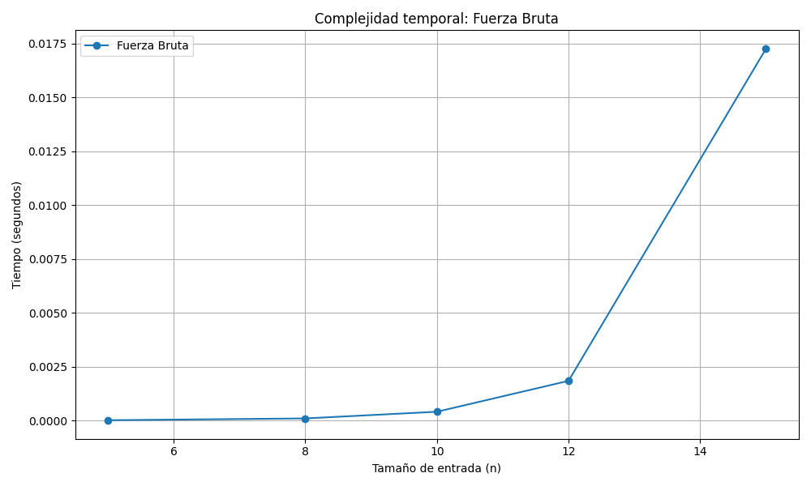
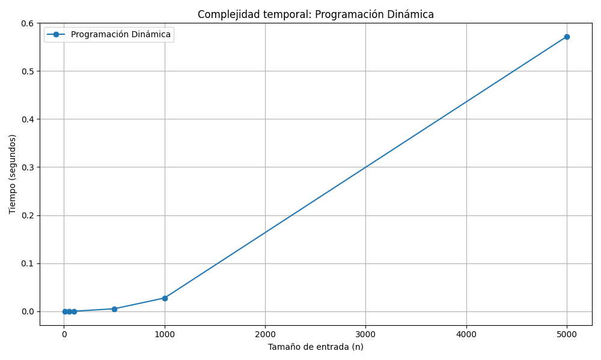
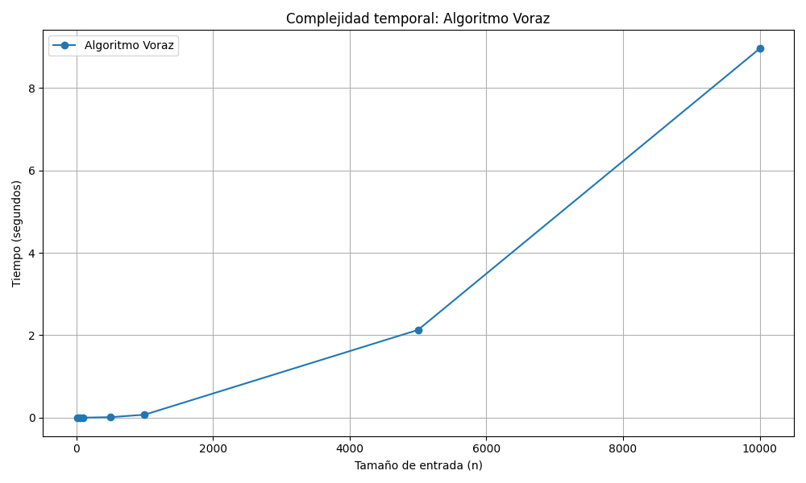
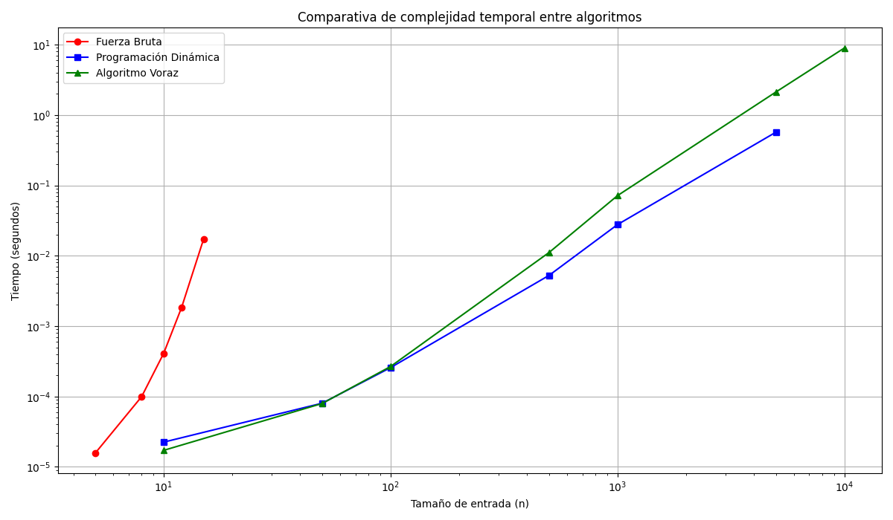

# Informe de Complejidad de Algoritmos - Problemas 1 y 2

Este informe presenta el análisis de complejidad computacional de los algoritmos desarrollados para los Problemas 1 (Subsecuencia Palíndroma Más Larga) y 2 (Planeando la Fiesta) del curso de Análisis y Diseño de Algoritmos 2. Se comparan sus enfoques, eficiencia y casos de uso.

## Problema 1: Subsecuencia Palíndroma Más Larga

**Descripción**:  
Dada una cadena, encontrar la subsecuencia (no necesariamente continua) más larga que sea palíndromo.

### A. Fuerza Bruta
**Enfoque**:
- Genera todas las combinaciones posibles de letras
- Verifica si son palíndromos
- Guarda el más largo encontrado

**Complejidad**:
- Tiempo: O(2ⁿ * n)  
- Espacio: O(n)  

- Hay 2^n subconjuntos posibles de una cadena de longitud n.
- Verificar si un subconjunto es palíndromo toma O(n) en el peor caso

**Notas**:
- Solo viable para cadenas pequeñas (n ≤ 20)

### B. Programación Dinámica
**Enfoque**:
- Usa una matriz `dp[i][j]` que guarda la longitud del palíndromo más largo entre las posiciones i y j

**Complejidad**:
- Tiempo: O(n²)  
- Espacio: O(n²)  (por la matriz n x n)

- Llenar una matriz n x n toma O(n^2) tiempo.
- Cada celda se llena en O(1).

**Notas**:
- Eficiente incluso para miles de caracteres
- Siempre encuentra la solución óptima

### C. Voraz
**Enfoque**:
- Busca caracteres iguales desde extremos y arma un palíndromo aproximado

**Complejidad**:
- Tiempo: O(n²)  
- Espacio: O(n)  

**Notas**:
- Más rápido en la práctica
- Puede no encontrar la solución óptima

---

## Problema 2: Planeando la Fiesta

**Descripción**:  
Seleccionar un subconjunto de empleados maximizando la suma de calificaciones, sin invitar a un supervisor y subordinado directos al mismo tiempo.

### A. Fuerza Bruta
**Enfoque**:
- Explora todos los subconjuntos posibles
- Verifica restricciones de jerarquía

- 2^n subconjuntos.
- Verificar restricciones cuesta O(n^2) en el peor caso (nodos conectados).

**Complejidad**:
- Tiempo: O(2ⁿ*n²)  
- Espacio: O(n)  

**Notas**:
- Solo se puede usar hasta 10-15 empleados
- O sea que sirve para validaciones en casos pequeños

### B. Programación Dinámica sobre Árboles
**Enfoque**:
- DP sobre cada subárbol con estados de incluir o excluir cada nodo

**Complejidad**:
- Tiempo: O(n)  
- Espacio: O(n)

- Visita cada nodo y sus hijos una sola vez.
- No hay recomputaciones gracias a memoización.

**Observaciones**:
- Muy eficiente si la estructura es un árbol

### C. Voraz
**Enfoque**:
- Ordena por calificación y selecciona greedy si no hay conflicto jerárquico

**Complejidad**:
- Tiempo: O(nlog n+n²) (por la verificación de conflictos)  
- Espacio: O(n)  

**Observaciones**:
- Ideal para entradas masivas (hasta 50.000 empleados)
- Puede no ser óptimo pero es muy rápido
- Buen balance entre precisión y rendimiento

---

## ¿Como se obtienen las complejidades en general?
**Contar bucles anidados** 
- bucles anidados con n iteraciones => O(n^2)

**Ver crecimiento exponencial** 
- si exploras todos los subconjuntos => O(2^n)

**Uso de estructuras como heapq, dict, set** 
- pueden afectar la eficiencia.

**DP (programación dinámica)**
- suele ser O(n^2) o O(n) si es sobre árboles.

**Heap (voraz)**
- ordenamiento O(n log n) más verificaciones. 

## Comparación General

| Problema | Estrategia         | Tiempo   | Óptima | Uso sugerido           |
|----------|--------------------|----------|--------|------------------------|
| P1       | Fuerza Bruta       | O(2ⁿ*n)  | Sí     | Solo casos juguete     |
| P1       | Dinámica           | O(n²)    | Sí     | Todo tamaño            |
| P1       | Voraz              | O(n²)    | No     | Grandes (aproximado)   |
| P2       | Fuerza Bruta       | O(2ⁿ*n²) | Sí     | Solo hasta n=10        |
| P2       | Dinámica (DP-árbol)| O(n)     | Sí     | Árboles y bosques      |
| P2       | Voraz              | O(nlogn+n²)| No     | Datos masivos (>10k)   |

---

## Conclusión

1. Hallamos que las soluciones de **programación dinámica** son las más equilibradas en cuanto a eficiencia y exactitud nos referimos
2. Las estrategias **voraces** son muy útiles cuando el tamaño de los datos es muy grande y hace inviable otras técnicas.
3. La **fuerza bruta** cumple un papel importante para validación en pruebas pequeñas pero es inviable si el tamaño de datos es muy grande.

## Gráficas Problema 1

- Imagen donde se muestra gráficamente la fuerza bruta en problema 1

- Imagen donde se muestra graficamente la programacion dinamica en problema 1

- Imagen donde se muestra graficamente la solucion voraz en problema 1

## Gráficas Problema 2

- Imagen donde se muestra gráficamente la fuerza bruta en problema 2

- Imagen donde se muestra graficamente la programacion dinamica en problema 2

- Imagen donde se muestra graficamente la solucion voraz en problema 2

## Comparativa de algoritmos

